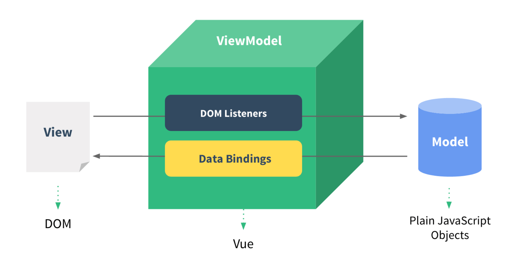
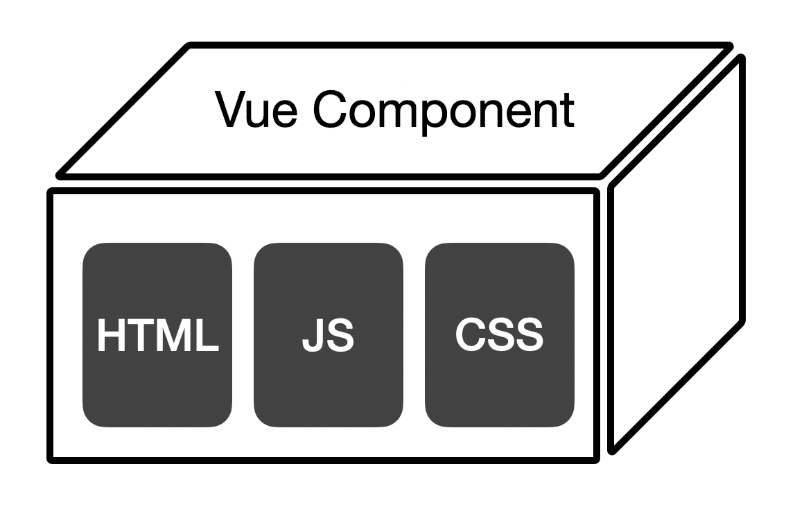
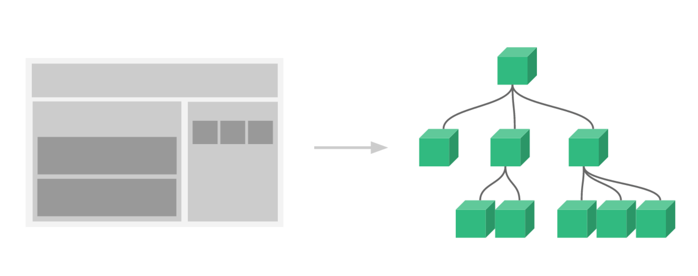

# Vue

## 概念說明
* slot vs props, slot-scope vs emit
* :is - 
'''
* <component :is="view"></component>
'''
* keep-alive

***
* 指令式渲染 vs. 宣告式渲染 (MVVM Model)

* 元件系統
    1. Component基本元素
        
    2. Component複用、堆疊
        

* Vue3 新增特性
    * Fragment 不再限制元件必須只能是單一根節點
    * 響應式偵測由 Object.defineProperty 改為 Proxy API，解決了過去 Vue 2.x 在物件、陣列更新偵測的問題
    * 新增 "Teleport"、"Suspense" 等功能型元件，擴充了更多可能性
    * 新增 "Teleport"、"Suspense" 等功能型元件，擴充了更多可能性
    * setup、ref 等語法糖，開發時的體驗更好
    * Vue.js 開源社群也為周邊生態圈不停地努力。瀏覽器裡的 Vue 開發/除錯工具 Vue-Devtools、VSCode 的知名套件 vetur、vite

* 指令
